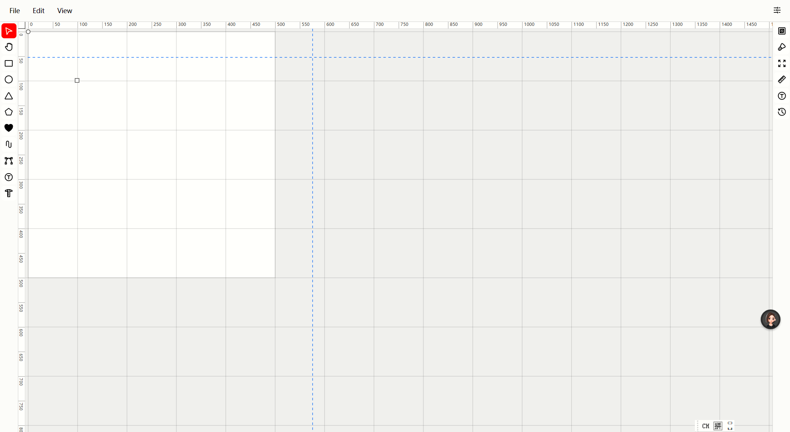
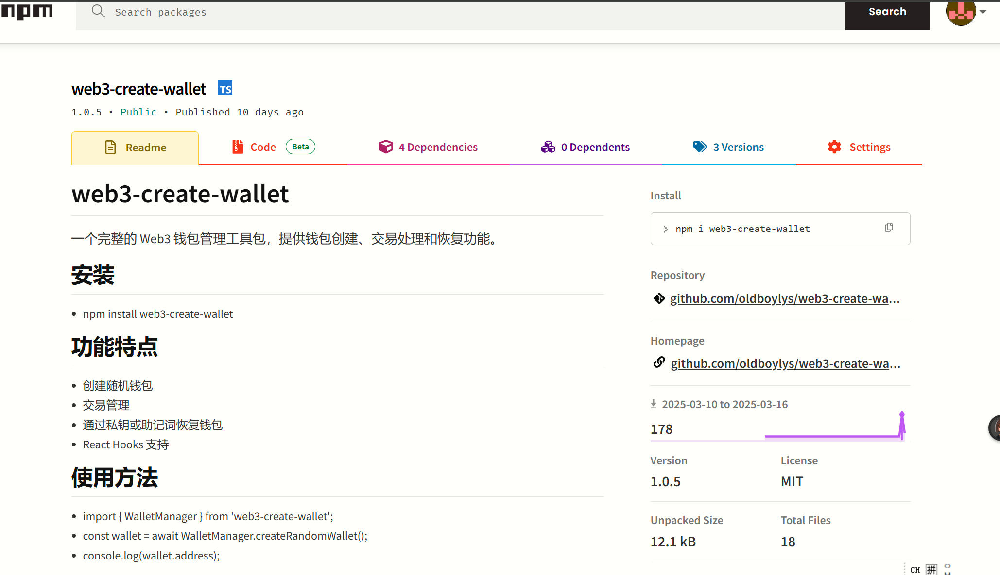

# 
#  Hi, I'm oldboylys

  

## 🚀 About Me

- 🔭 Hello, I'm a front-end developer graduating in 2019. Continuously striving to improve!
- 🌱 Passion on development , particular in web3.0 , i am trying to get involved in Ethereum constructor , study more about smart contract~
- 📫 Contact me: [lianyanshao@gmail.com](mailto:lianyanshao@gmail.com)

## Personal program 

<h3>svgEditor</h3>

<h3>web3-wallet-npm</h3>

  
## 🤝 Open Source Contributions

## 🛠 Tech Stack

  

  <img src="https://github-readme-stats.vercel.app/api/top-langs/?usernam
